<h1 align="center"> 🖥️ My Awesome TUI Apps </h1>

<div align="center">

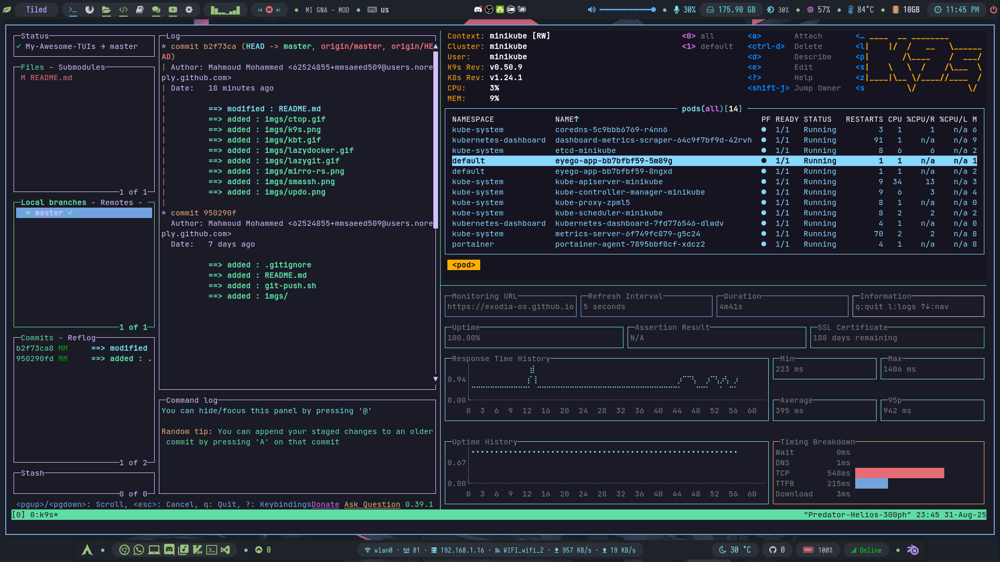

*A curated collection of powerful Terminal User Interface (TUI) applications for developers and power users*

[](https://github.com/mmsaeed509/My-Awesome-TUIs)
[](https://github.com/mmsaeed509/My-Awesome-TUIs)
[](https://github.com/mmsaeed509/My-Awesome-TUIs/issues)
[](https://github.com/mmsaeed509/My-Awesome-TUIs/blob/master/LICENSE)

</div>

## 📋 Table of Contents

- [📋 Table of Contents](#-table-of-contents)
- [🎯 About](#-about)
- [📂 Categories](#-categories)
- [🔍 System Monitoring](#-system-monitoring)
  - [Below](#below)
  - [s-TUI](#s-tui)
  - [nvtop](#nvtop)
  - [asitop](#asitop)
  - [WaveMon](#wavemon)
  - [witr](#witr)
  - [NetWatch](#netwatch)
  - [Nibble](#nibble)
  - [BatCLI](#batcli)
  - [UptimeKit](#uptimekit)
- [🛠️ Development Tools](#️-development-tools)
  - [LazyGit](#lazygit)
  - [JiraTUI](#jiratui)
  - [Neovate Code](#neovate-code)
  - [Kairo](#kairo)
  - [GrayMatter](#graymatter)
- [🐳 Container Management](#-container-management)
  - [LazyDocker](#lazydocker)
  - [Oxker](#oxker)
  - [Ctop](#ctop)
- [📁 File Management](#-file-management)
  - [Superfile](#superfile)
- [🌐 Web \& Media](#-web--media)
  - [Browsh](#browsh)
  - [GopherTube](#gophertube)
  - [Spotify TUI](#spotify-tui)
  - [Posting](#posting)
  - [Feroxbuster](#feroxbuster)
  - [WireMix](#wiremix)
  - [MapSCII](#mapscii)
  - [PulseDeck](#pulsedeck)
  - [Vibez](#vibez)
- [💬 Communication](#-communication)
  - [Discordo](#discordo)
  - [SSHMail](#sshmail)
- [☸️ Kubernetes \& DevOps](#️-kubernetes--devops)
  - [K9s](#k9s)
  - [KubeTUI](#kubetui)
  - [Updo](#updo)
  - [Stakpak](#stakpak)
  - [CronBoard](#cronboard)
- [⚙️ Utilities](#️-utilities)
  - [Nushell](#nushell)
  - [SSHM](#sshm)
  - [HoneyMux](#honeymux)
  - [Envy](#envy)
  - [evtr](#evtr)
  - [TUIOS](#tuios)
  - [Smassh](#smassh)
  - [KBT](#kbt)
  - [Mirro-rs](#mirro-rs)
  - [Impala](#impala)
  - [TUFW](#tufw)
  - [BlueTUI](#bluetui)
- [🚀 Installation](#-installation)
  - [Using Package Managers](#using-package-managers)
  - [Manual Installation](#manual-installation)
    - [JiraTUI (Python)](#jiratui-python)
    - [KubeTUI (Rust)](#kubetui-rust)
    - [asitop (Python)](#asitop-python)
    - [Neovate Code (Node.js)](#neovate-code-nodejs)
  - [Prerequisites](#prerequisites)
- [🤝 Contributing](#-contributing)
- [📄 License](#-license)

## 🎯 About

This repository showcases a carefully curated collection of Terminal User Interface (TUI) applications that enhance productivity and provide powerful functionality directly in your terminal. These tools are perfect for developers, system administrators, and power users who prefer keyboard-driven interfaces.

> 💡 **Pro Tip**: Check out [**Exodia-TUI-CLI-Apps**](https://github.com/Exodia-OS/Exodia-TUI-CLI-Apps) for an even more comprehensive collection of TUI applications!
>
> 🌐 **Explore More**: Discover trending terminal apps at [**Trending Terminal**](https://itrending.top/).

## 📂 Categories

The applications are organized into the following categories for easy navigation:

- 🔍 **System Monitoring** - Resource monitoring and system analysis tools
- 🛠️ **Development Tools** - Git management and development utilities
- 🐳 **Container Management** - Docker and container orchestration tools
- 📁 **File Management** - File system navigation and management
- 🌐 **Web & Media** - Web browsing and media consumption
- 💬 **Communication** - Chat and messaging clients
- ☸️ **Kubernetes & DevOps** - Kubernetes management and DevOps tools
- ⚙️ **Utilities** - Various utility applications

---

## 🔍 System Monitoring

### [Below](https://github.com/facebookincubator/below)
A time traveling resource monitor for modern Linux systems with advanced debugging capabilities.

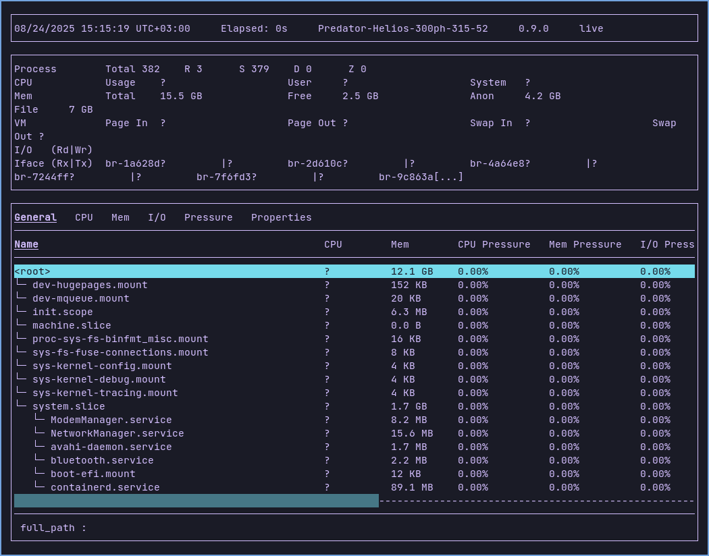

**Features:**
- Real-time system resource monitoring
- Historical data analysis
- Advanced debugging tools
- Modern Linux system support

### [s-TUI](https://github.com/amanusk/s-tui)
Terminal-based CPU stress and monitoring utility with an intuitive interface.

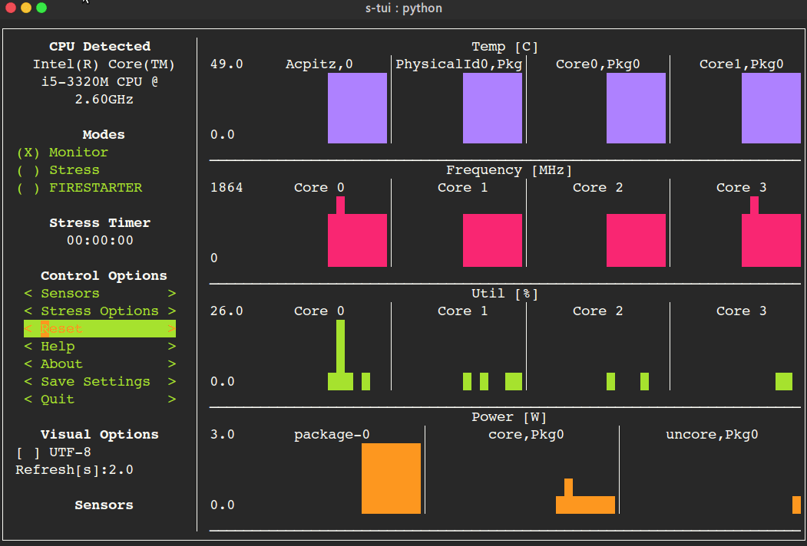

**Features:**
- CPU stress testing
- Real-time temperature monitoring
- System performance metrics
- Interactive terminal interface

### [nvtop](https://github.com/Syllo/nvtop)
GPU & Accelerator process monitoring for AMD, Apple, Huawei, Intel, NVIDIA and Qualcomm.

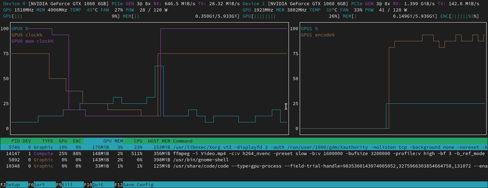

**Features:**
- Multi-vendor GPU support
- Process monitoring
- Memory usage tracking
- Temperature monitoring
- Power consumption metrics

### [asitop](https://github.com/tlkh/asitop)
Perf monitoring CLI tool for Apple Silicon with detailed performance insights.

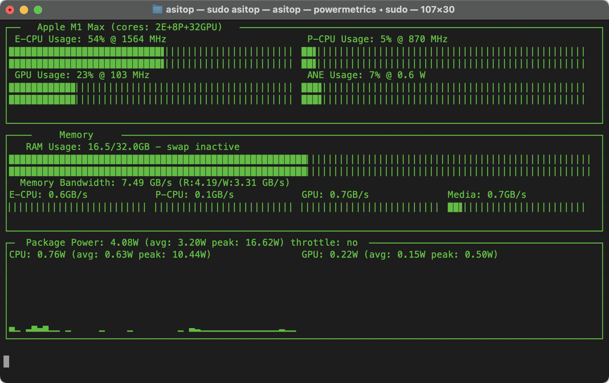

**Features:**
- Apple Silicon optimization
- Performance counter monitoring
- CPU and GPU metrics
- Memory bandwidth tracking
- Power efficiency analysis

### [WaveMon](https://github.com/uoaerg/wavemon)
wavemon is an ncurses-based monitoring application for wireless network devices on Linux.

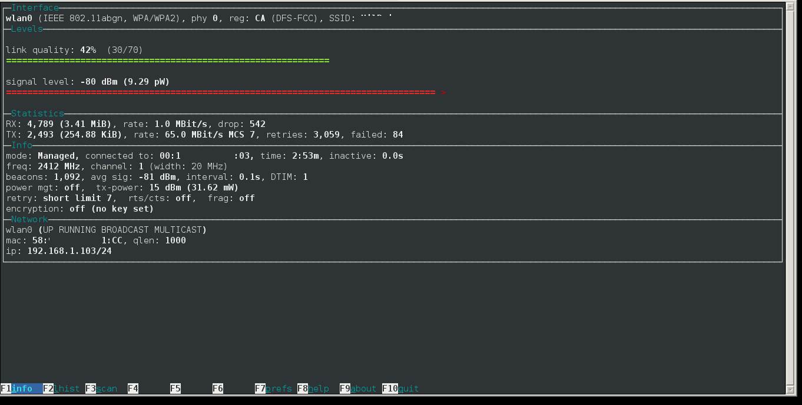

**Features:**
- Wireless network monitoring
- Signal strength tracking
- Network quality analysis
- Real-time statistics
- Linux wireless device support

### [witr](https://github.com/pranshuparmar/witr)
witr exists to answer a single question: Why is this running?

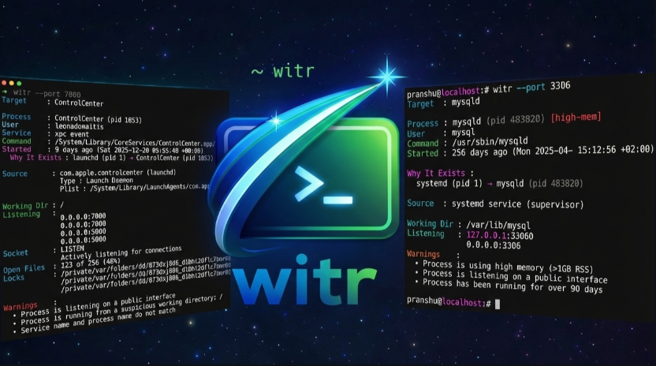

**Features:**
- Explains process existence (Name, PID, Port targets)
- Tracks ancestry chain and source
- Context awareness (Git, Docker, Kubernetes)
- Multiple output formats (Short, Tree)

### [NetWatch](https://github.com/matthart1983/netwatch)
Real-time network diagnostics in your terminal. One command, zero config, instant visibility.


**Features:**
- Real-time interface and connection visibility
- Health probes and packet capture support
- Timeline and topology views for incident analysis
- Flight recorder workflow for transient network issues

### [Nibble](https://github.com/backendsystems/nibble)
Nibble is a CLI tool for local network scanning that focuses on speed and ease of use.

Select a network interface, and it scans your local subnet. Lists hosts, hardware manufacturer, open ports and their services.

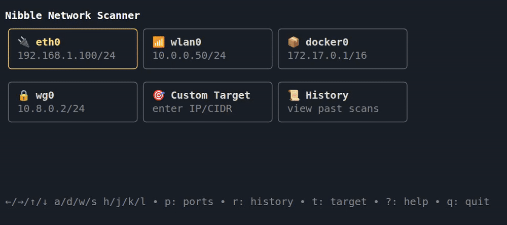

**Features:**
- Fast local subnet scanning with clickable TUI and mouse support
- Host discovery with vendor identification and open port/service detection
- Docker/WSL network support and scan history
- Headless mode with JSON output for scripting

### [BatCLI](https://github.com/Ooooze/batctl)
⚡ Battery charge threshold manager for Linux laptops.


**Features:**
- Interactive TUI and scriptable CLI modes
- Start/stop battery threshold management
- Vendor-aware backend auto-detection
- Persistent settings across reboot/resume

### [UptimeKit](https://github.com/abhixdd/UptimeKit-CLI)
A modern, cross-platform CLI to monitor websites and APIs.

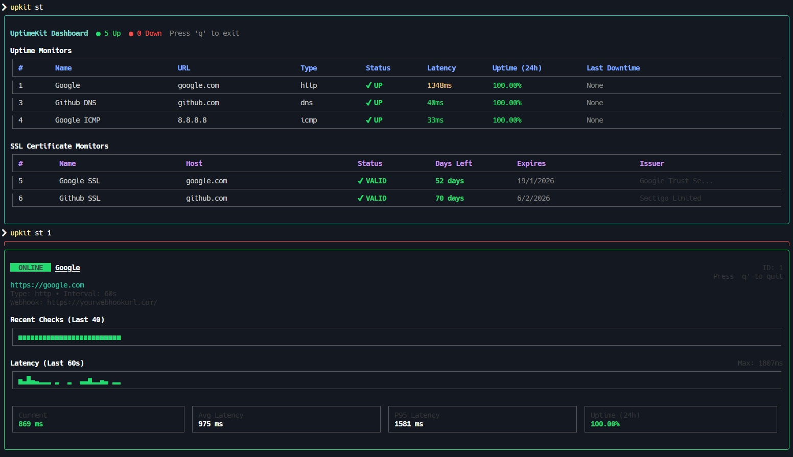

**Features:**
- Live dashboard with uptime and latency metrics
- HTTP, ICMP, DNS, and SSL monitoring
- Grouped monitors and webhook alerts
- Background daemon with desktop notifications

---

## 🛠️ Development Tools

### [LazyGit](https://github.com/jesseduffield/lazygit)
Simple terminal UI for git commands with an intuitive interface.


**Features:**
- Visual git workflow
- Branch management
- Commit history
- Interactive rebasing

### [JiraTUI](https://github.com/whyisdifficult/jiratui)
A Textual User Interface for interacting with Atlassian Jira from your shell.

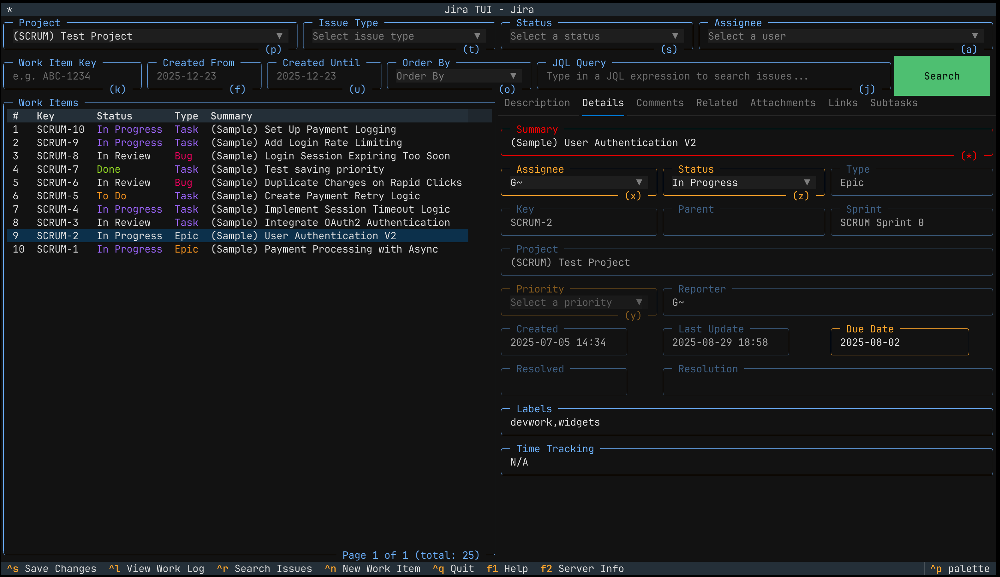

**Features:**
- Launch full TUI for Jira issues and workflows
- Search, update, and delete issues
- Manage comments and users
- Config via env, .env or YAML
- Ships CLI with `ui`, `issues`, `comments`, `users`

### [Neovate Code](https://github.com/neovateai/neovate-code)
Neovate Code is a code agent to enhance your development. Use it to generate code, fix bugs, review code, add tests, and more. Supports interactive and headless modes.

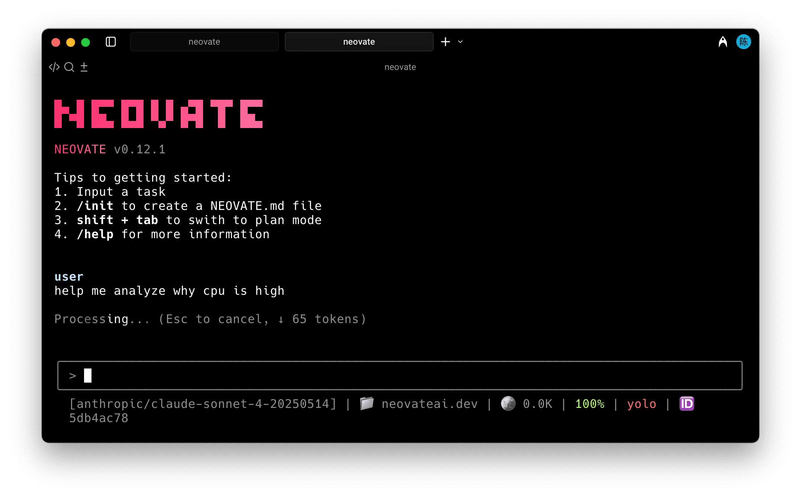

**Features:**
- Interactive and headless automation
- Code generation and refactoring
- Bug fixing and code review
- Test generation
- Provider-agnostic with easy model selection

### [Kairo](https://github.com/programmersd21/kairo)
🤩 Kairo is a fast, keyboard-first terminal task manager in Go 🐹 with offline-first SQLite, Git sync 🔁, fuzzy search 🔍 & Lua plugins 🧩


**Features:**
- Offline-first SQLite task storage
- Keyboard-first TUI with fuzzy search
- Git sync for portable task workflows
- Lua plugin system and CLI automation support

### [GrayMatter](https://github.com/angelnicolasc/graymatter)
Three lines of code to give your AI agents persistent memory. Reduce 90% token consumption while also maintaining quality.


**Features:**
- Persistent memory layer for MCP-compatible AI agents
- Significant token reduction through memory recall
- Works as both CLI tool and Go library
- Includes terminal dashboard for memory observability

---

## 🐳 Container Management

### [LazyDocker](https://github.com/jesseduffield/lazydocker)
The lazier way to manage everything Docker with a beautiful TUI.


**Features:**
- Container management
- Image management
- Volume management
- Network monitoring

### [Oxker](https://github.com/mrjackwills/oxker)
A simple TUI to view & control Docker containers with ease.

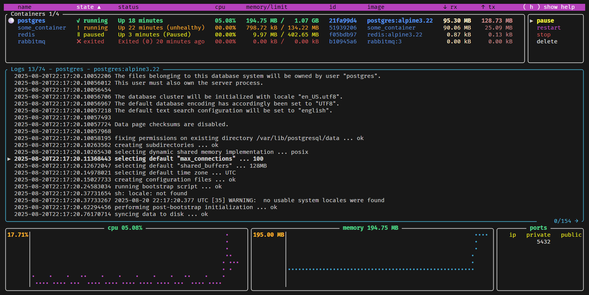

**Features:**
- Container status overview
- Start/stop containers
- Resource usage monitoring
- Log viewing

### [Ctop](https://github.com/bcicen/ctop)
Top-like interface for container metrics with real-time monitoring.

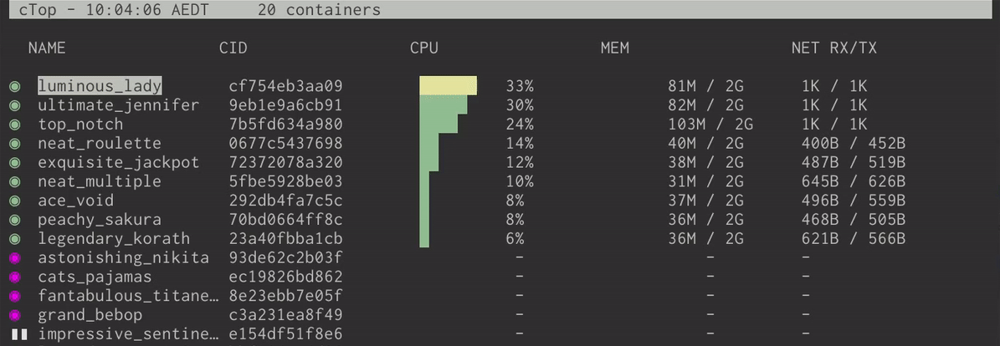

**Features:**
- Real-time container metrics
- Resource usage visualization
- Container management actions
- Multi-container support

---

## 📁 File Management

### [Superfile](https://github.com/yorukot/superfile)
Pretty fancy and modern terminal file manager with advanced features.

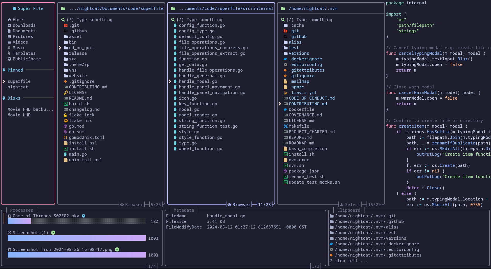

**Features:**
- Modern file navigation
- File operations
- Search functionality
- Customizable interface

---

## 🌐 Web & Media

### [Browsh](https://github.com/browsh-org/browsh)
A fully-modern text-based browser, rendering to TTY and browsers.

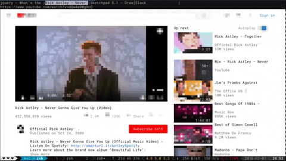

**Features:**
- Full web browser functionality
- JavaScript support
- Modern web rendering
- Cross-platform compatibility

### [GopherTube](https://github.com/krishnassh/gophertube)
A modern terminal user interface for searching and watching YouTube videos using mpv and chafa.

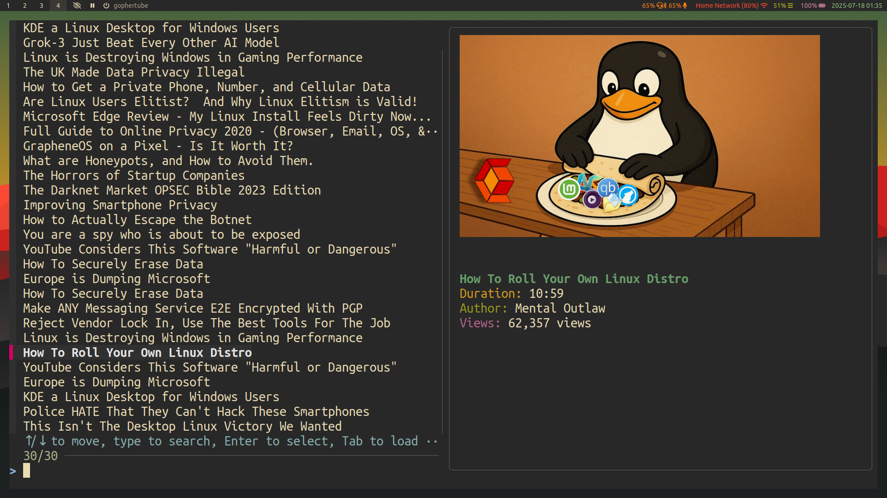

**Features:**
- YouTube video search
- Video playback with mpv
- Thumbnail previews
- Playlist management

### [Spotify TUI](https://github.com/Rigellute/spotify-tui)
Spotify for the terminal written in Rust 🚀


### [Posting](https://github.com/darrenburns/posting)
The modern API client that lives in your terminal.

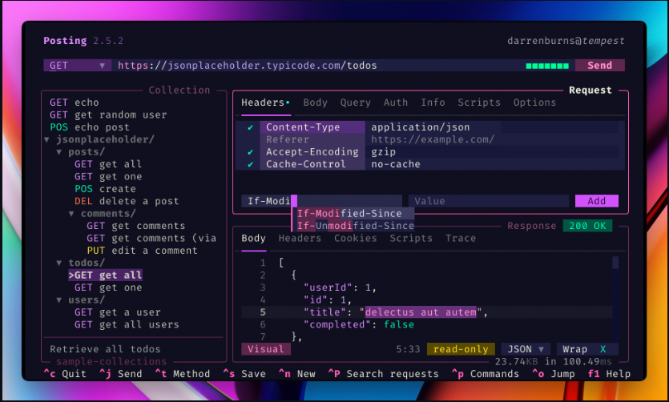

**Features:**
- REST API testing
- Request/response visualization
- Environment management
- Request history

### [Feroxbuster](https://github.com/epi052/feroxbuster)
A fast, simple, recursive content discovery tool written in Rust.

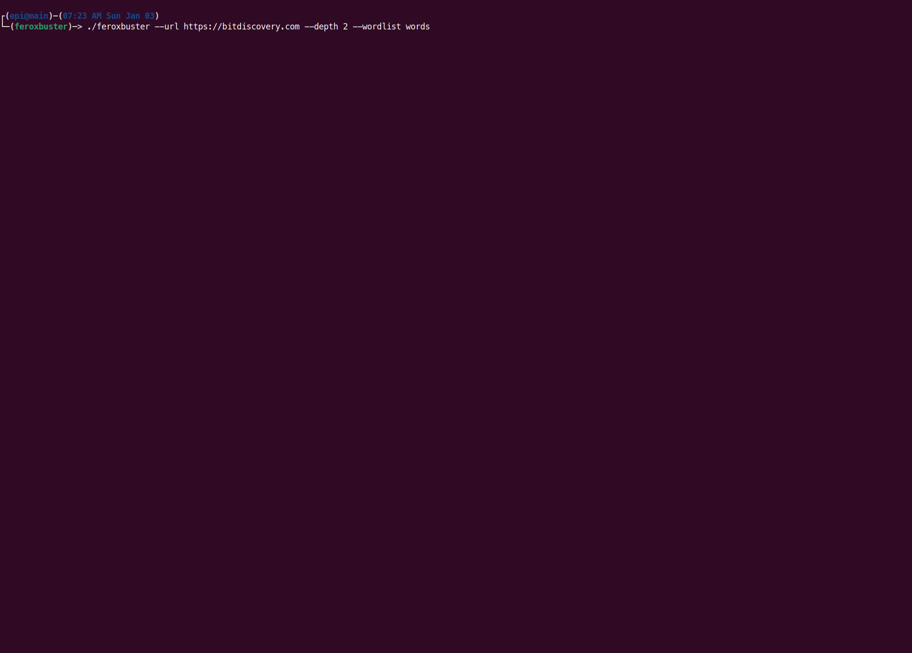

**Features:**
- Fast recursive content discovery
- Multi-threaded scanning
- Customizable wordlists
- Advanced filtering options
- JSON output support

### [WireMix](https://github.com/tsowell/wiremix)
Simple TUI audio mixer for PipeWire.


**Features:**
- PipeWire audio mixing
- Volume control from the terminal
- Simple keyboard-driven interface
- Real-time level monitoring

### [MapSCII](https://github.com/rastapasta/mapscii)
🗺 MapSCII is a Braille & ASCII world map renderer for your console — enter `telnet mapscii.me` on Mac (`brew install telnet`) and Linux, or connect with PuTTY on Windows.

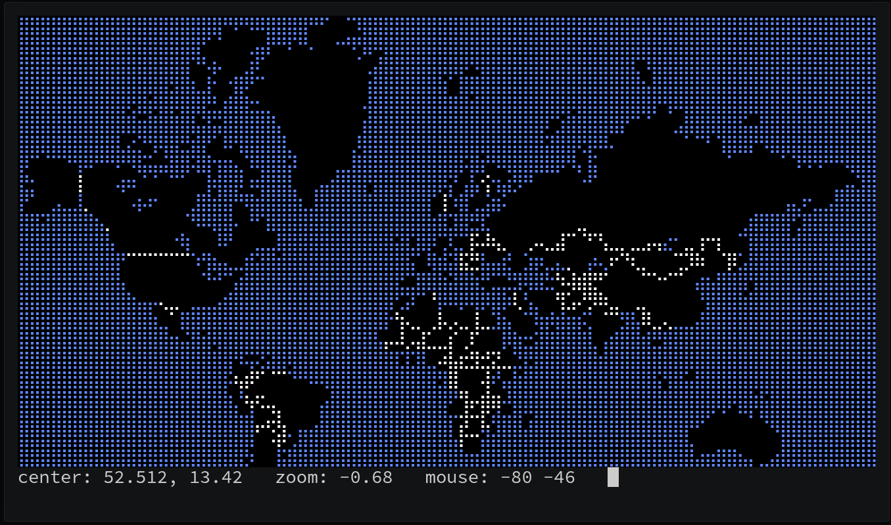

**Features:**
- Interactive Braille and ASCII world map in the terminal
- Mouse drag/zoom and keyboard navigation
- POI discovery and customizable Mapbox-style layers
- Works with public/private vector tile servers and offline MBTiles

### [PulseDeck](https://github.com/milgaj84/pulsedeck)
Cyber-synthwave internet radio player for the terminal. Stream any station, record tracks automatically with smart ad filtering, sorted into genre folders. Built in Rust.

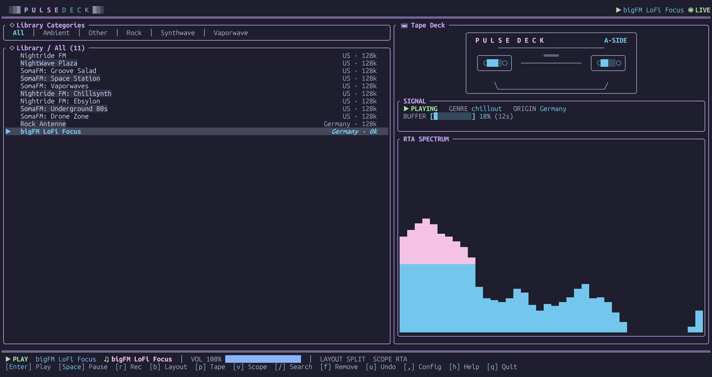

**Features:**
- Stream internet radio stations from the terminal
- Automatic track recording with smart ad filtering
- Genre-sorted library organization
- Rust-based TUI with synthwave-style UX

### [Vibez](https://github.com/simonepelosi/vibez)
vibez is an open-source TUI Apple Music player for Linux and macOS. Search, queue, and control playback entirely from the keyboard.

Full tracks stream via Chrome with Widevine DRM. On Linux amd64, Chrome is auto-downloaded into vibez's private cache; on other Linux builds, WebKit + GStreamer remains available as a 30-second preview backend. On macOS, install Google Chrome before using Apple Music playback.

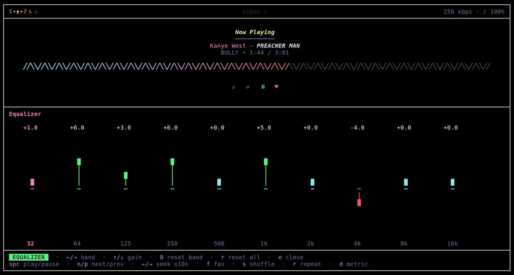

**Features:**
- Keyboard-first Apple Music search, queue, and playback control
- Full-track streaming via Chrome/Widevine on supported platforms
- Linux amd64 auto-downloads Chrome into a private cache
- WebKit + GStreamer preview fallback on other Linux builds

---

## 💬 Communication

### [Discordo](https://github.com/ayn2op/discordo)
A lightweight, secure, and feature-rich Discord terminal (TUI) client.

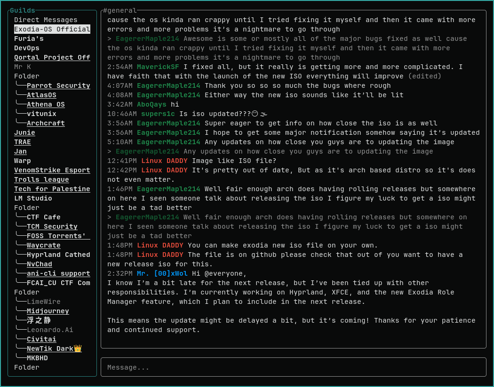

**Features:**
- Lightweight Discord client
- Secure messaging
- Feature-rich interface
- Terminal-based communication
- Low resource usage

### [SSHMail](https://github.com/rolandnsharp/sshmail)
chat over ssh. no install or passwords. TUI and CLI


**Features:**
- Encrypted messaging over SSH with public-key identity
- No install required for hosted usage (`ssh sshmail.dev`)
- Built-in TUI and JSON-friendly CLI commands
- Supports inbox, public boards, groups, and file attachments

---

## ☸️ Kubernetes & DevOps

### [K9s](https://github.com/derailed/k9s)
🐶 Kubernetes CLI To Manage Your Clusters In Style!

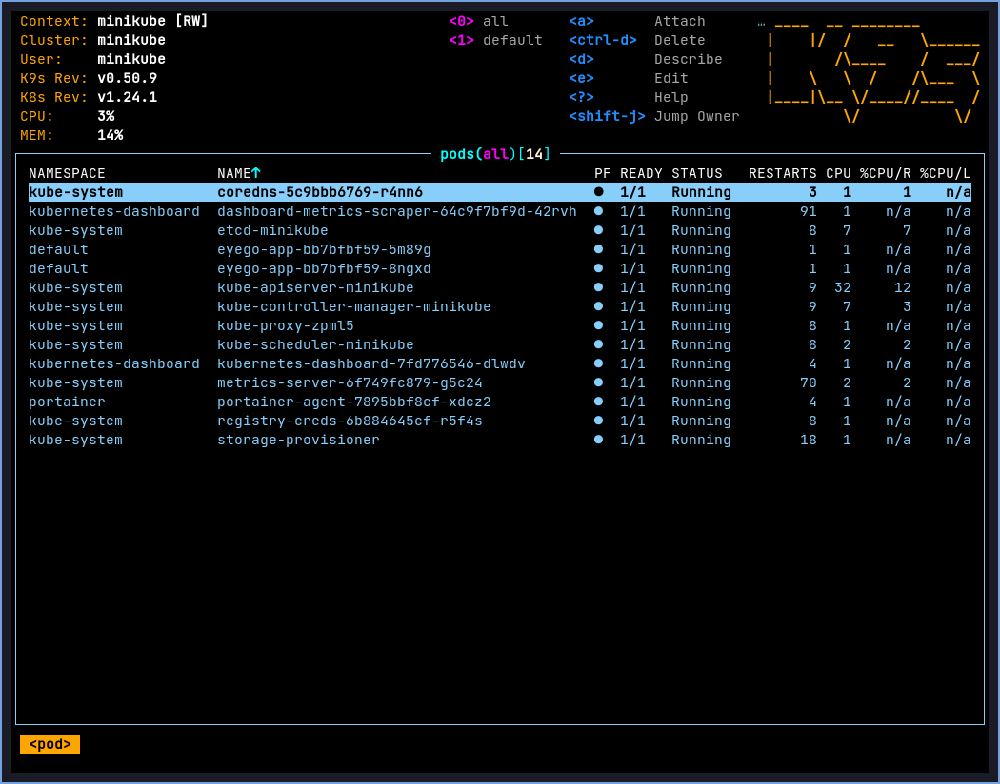

**Features:**
- Kubernetes cluster management
- Pod monitoring
- Service management
- Resource visualization

### [KubeTUI](https://github.com/sarub0b0/kubetui)
An intuitive Terminal User Interface (TUI) tool for real-time monitoring and exploration of Kubernetes resources.

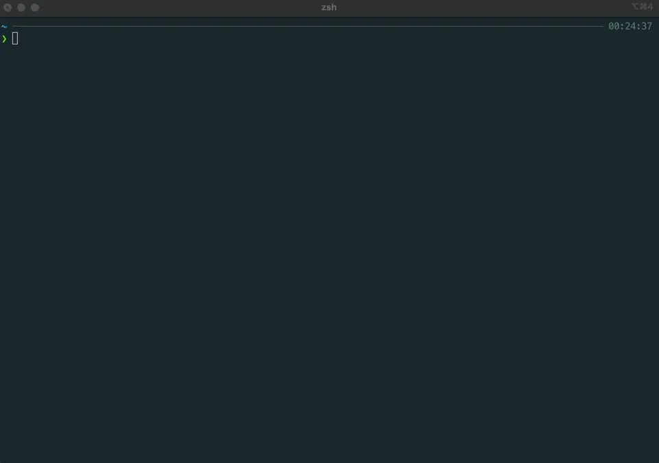

**Features:**
- Real-time Kubernetes resource monitoring
- Multi-namespace support
- Advanced log filtering and search
- Interactive resource exploration
- YAML viewing and editing
- Context and namespace switching

### [Updo](https://github.com/Owloops/updo)
Uptime monitoring CLI tool with alerting and advanced settings.

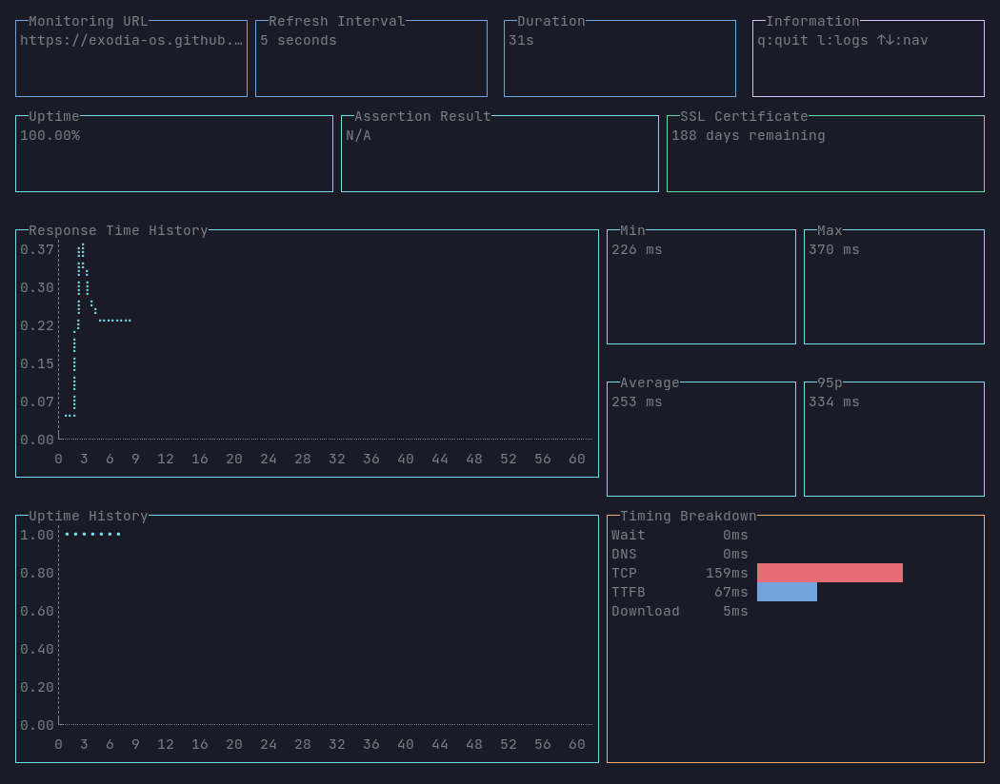

**Features:**
- Website uptime monitoring
- Alert notifications
- Custom monitoring intervals
- Status reporting

### [Stakpak](https://stakpak.dev)
AI DevOps Agent in your Terminal.

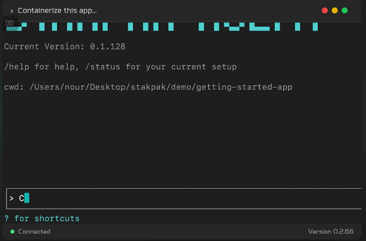

**Features:**
- AI-powered DevOps automation
- Terminal-based interface
- Intelligent workflow management
- DevOps task automation
- Infrastructure management assistance

### [CronBoard](https://github.com/antoniorodr/cronboard)
A terminal-based dashboard for managing cron jobs locally and on servers.


**Features:**
- Create, edit, pause, resume, and delete cron jobs from a Textual TUI
- View logs, last/next run times, and validation feedback
- SSH support for remote servers (password or key)
- Search jobs and manage another user's crontab with sudo

---

## ⚙️ Utilities

### [Nushell](https://github.com/nushell/nushell)
A new type of shell with structured data pipelines and modern UX.

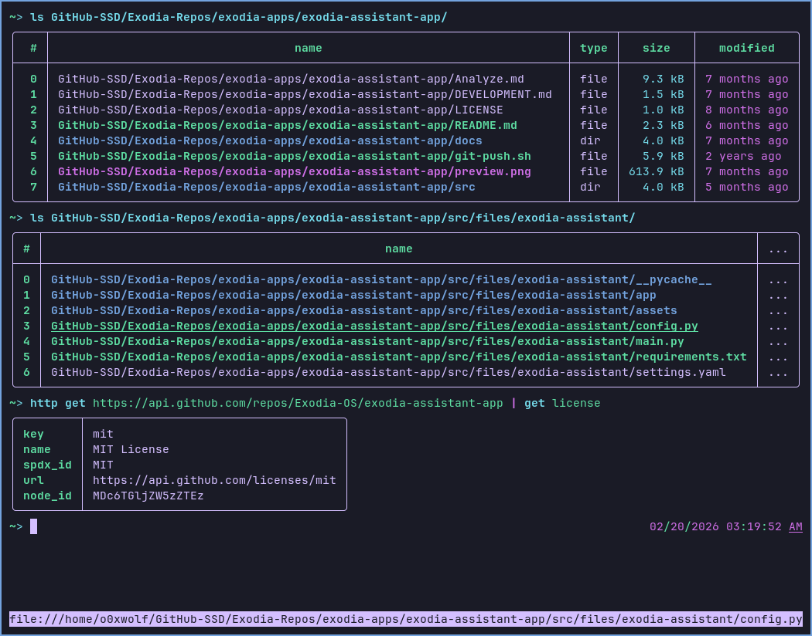

**Features:**
- Cross-platform (Linux, macOS, Windows, BSD)
- Structured data pipelines (tables, not raw text)
- Built-in support for JSON, YAML, SQLite, Excel, and more
- Powerful plugin system
- Typed data with helpful error messages

*[nushell.sh](https://www.nushell.sh/)*

### [SSHM](https://github.com/Gu1llaum-3/sshm)
**SSHM — SSH Manager** is a beautiful command-line tool that transforms how you manage and connect to your SSH hosts. Built with Go and featuring an intuitive TUI interface, it makes SSH connection management effortless and enjoyable.


**Features:**
- TUI and CLI (`sshm`, `sshm <host>`) with vim-style shortcuts
- Works with `~/.ssh/config`, Include directives, and custom config paths
- Port forwarding (local, remote, dynamic/SOCKS) with history
- Tags, search, live connectivity status, and connection history
- Add, edit, move hosts; automatic config backups; cross-platform

### [HoneyMux](https://github.com/honeymux/honeymux)
Honeymux is a TUI wrapper for tmux that adds a wide range of features and interaction surfaces to your terminal.

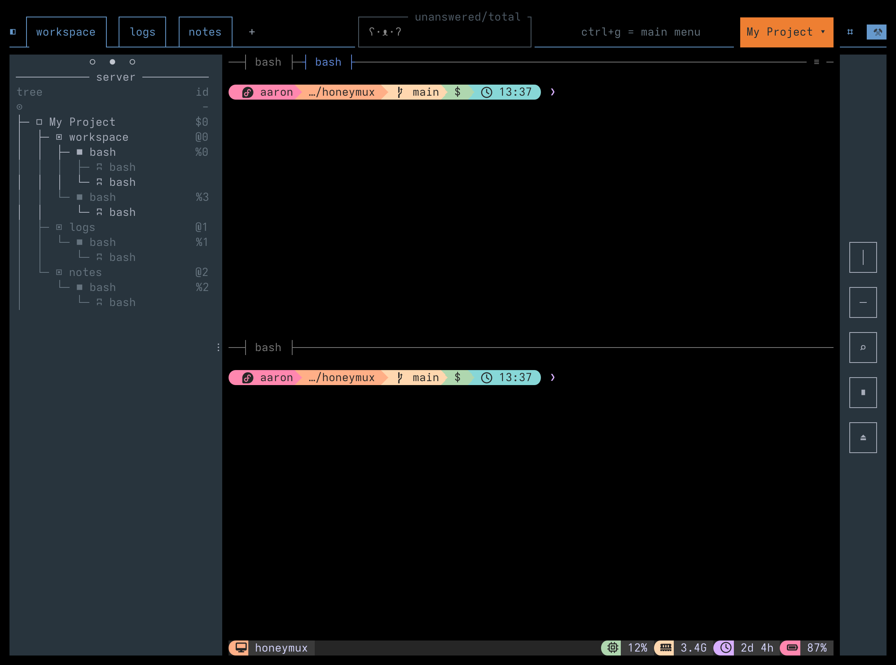

**Features:**
- Durable tmux-backed workspace for agents, shells, and TUIs
- Session management, pane tabs, and window tabs
- Sidebar and toolbar for richer terminal navigation
- Remote-backed pane stitching for SSH workflows

### [Envy](https://github.com/XENONCYBER/envy)
A terminal based tool for managing secrets with both tui and cli support.

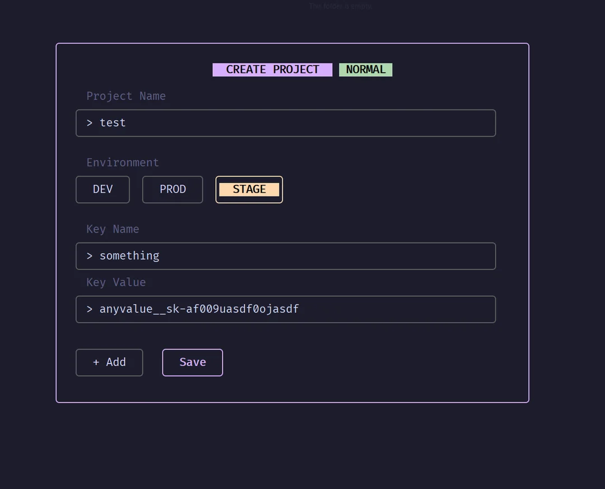

**Features:**
- Encrypted local vault for API keys and environment secrets
- TUI browsing and CLI automation in one tool
- Project/environment organization with quick search
- Import/export workflows for `.env` management

### [evtr](https://github.com/hal3e/evtr)
`evtr` is a TUI for inspecting Linux evdev input devices.

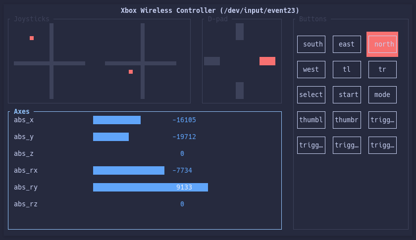

**Features:**
- Live monitoring for `/dev/input/event*` devices
- Inspect axes, buttons, hats, and touch state
- Device selector and monitor views built for Linux evdev
- Configurable controls with strict TOML config validation

### [TUIOS](https://github.com/Gaurav-Gosain/tuios)
TUIOS is a modern terminal multiplexer and window manager built with Go. It provides a vim-like modal interface with multiple terminal panes, workspaces, BSP tiling, kitty graphics protocol support, and a command palette - all running inside your existing terminal.

Built on the Charm stack (Bubble Tea v2, Lipgloss v2), TUIOS features event-driven rendering for near-zero idle CPU usage, flicker-free kitty image passthrough, and comprehensive keyboard/mouse interaction.


**Features:**
- Vim-like modal workflow with panes, workspaces, and tiling
- BSP layout engine and command palette for fast navigation
- Kitty graphics protocol support with flicker-free passthrough
- Event-driven rendering architecture for low idle CPU usage

### [Smassh](https://github.com/kraanzu/smassh)
Smassh your Keyboard, TUI Edition - a keyboard testing and training tool.

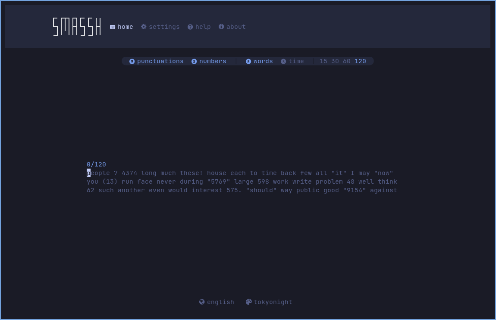

**Features:**
- Keyboard testing
- Typing speed measurement
- Custom text input
- Performance analytics

### [KBT](https://github.com/bloznelis/kbt)
Keyboard tester in terminal with comprehensive key testing.

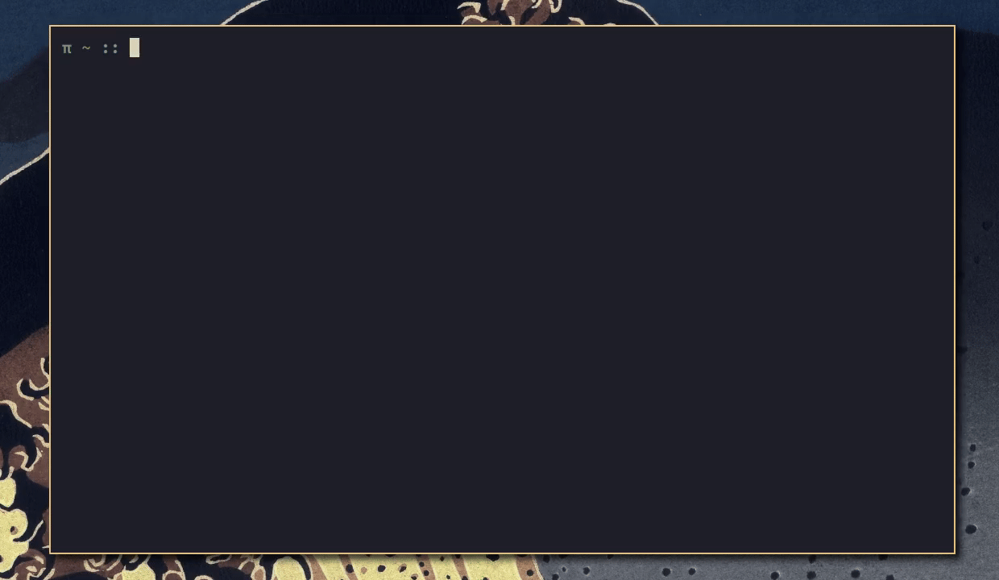

**Features:**
- Individual key testing
- Key combination testing
- Keyboard layout verification
- Input validation

### [Mirro-rs](https://github.com/rtkay123/mirro-rs)
An Arch Linux mirrorlist manager with a TUI for optimal package downloads.

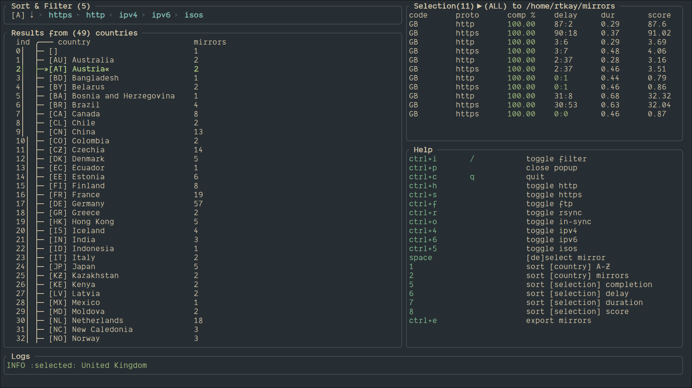

**Features:**
- Mirror speed testing
- Automatic mirror selection
- Manual mirror management
- Performance optimization

### [Impala](https://github.com/pythops/impala)
🛜 TUI for managing wifi on Linux with an intuitive interface.

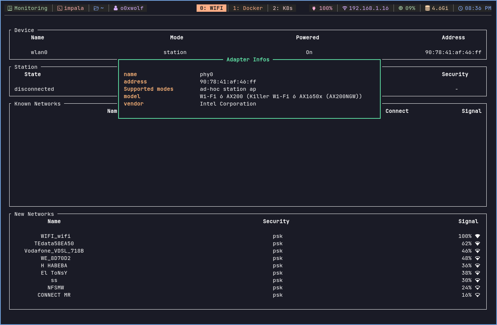

**Features:**
- WiFi network scanning and connection
- Device power management
- Access point creation
- Known networks management
- Custom keybindings support

### [TUFW](https://github.com/peltho/tufw)
Terminal UI for ufw - manage your firewall with ease.


**Features:**
- UFW firewall management
- Rule creation and editing
- Status monitoring
- User-friendly interface
- Linux firewall control

### [BlueTUI](https://github.com/pythops/bluetui)
🛜 TUI for managing bluetooth on Linux.

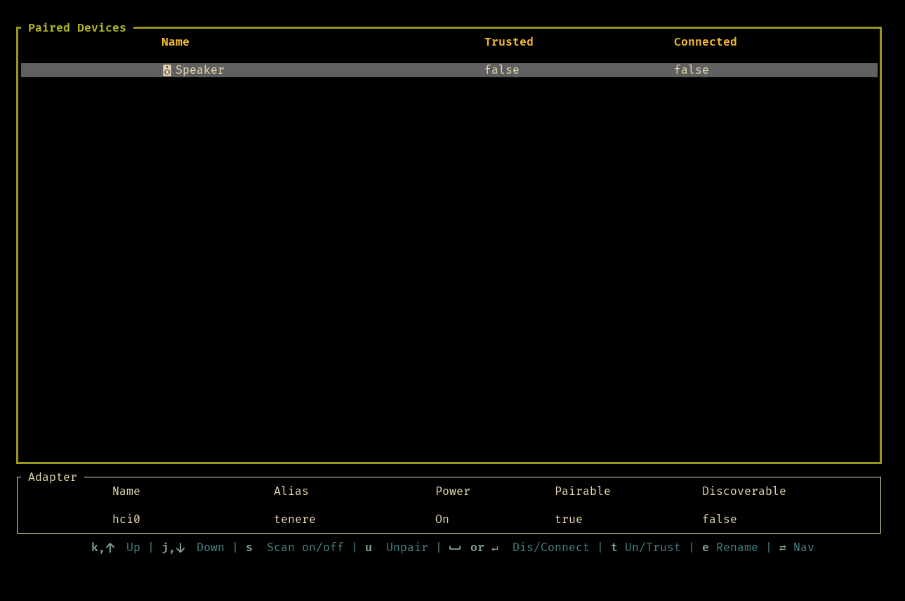

**Features:**
- Bluetooth device management
- Device pairing and connection
- Adapter control
- Device scanning
- Linux bluetooth support

---

## 🚀 Installation

Most of these applications can be installed using your system's package manager or through their respective installation methods:

### Using Package Managers

```bash
# Arch Linux / Manjaro
yay -S below posting oxker superfile browsh updo k9s ctop lazydocker lazygit impala s-tui nvtop wavemon nushell

# Ubuntu / Debian
sudo apt install ctop s-tui nvtop wavemon

# macOS
brew install k9s ctop lazydocker lazygit s-tui nvtop nushell
```

### Manual Installation

For applications not available in package managers, check their respective GitHub repositories for installation instructions.

#### JiraTUI (Python)

```bash
# Using uv (recommended)
uv add jiratui

# Or using pip
pip install jiratui
```

#### KubeTUI (Rust)

```bash
# Using cargo
cargo install kubetui
```

#### asitop (Python)

```bash
# Using pip
pip install asitop
```

#### Neovate Code (Node.js)

```bash
# Using npm (global)
npm install -g @neovate/code

# Run
neovate
# or
neo
```

### Prerequisites

- Terminal with true color support
- Modern Linux/macOS system
- Git (for cloning repositories)

---

## 🤝 Contributing

Contributions are welcome! Feel free to:

1. Fork this repository
2. Add new TUI applications
3. Improve documentation
4. Fix issues
5. Suggest enhancements

Please ensure that any added applications:
- Have an active GitHub repository
- Include a screenshot or GIF demo
- Are well-maintained and functional
- Provide value to developers or power users

---

## 📄 License

This project is licensed under the `GPL-3.0` License - see the [LICENSE](LICENSE) file for details.

---

<div align="center">

**⭐ Star this repository if you found it helpful!**

Made with ❤️ for the TUI community

</div>