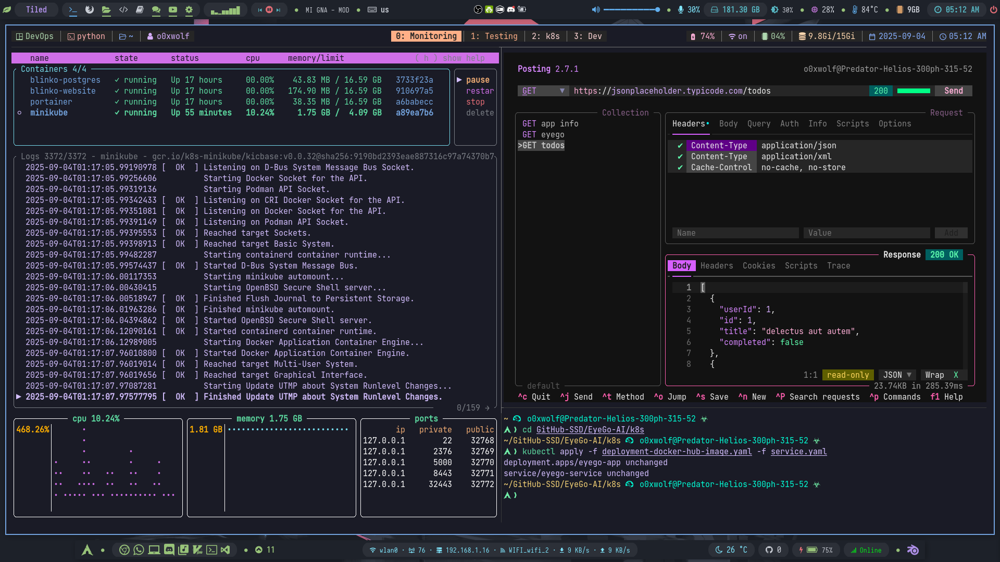

<h3 align="center"> My Awesome TUI Apps </h3>

> You can find out a whole bunch of TUI Apps here [**`Exodia-TUI-CLI-Apps`**](https://github.com/Exodia-OS/Exodia-TUI-CLI-Apps)

- [**`Below`**](https://github.com/facebookincubator/below): A time traveling resource monitor for modern Linux systems
  - 
  

- [**`posting`**](https://github.com/darrenburns/posting): The modern API client that lives in your terminal.
  - 

- [**`oxker`**](https://github.com/mrjackwills/oxker): A simple tui to view & control docker containers.
  - 

- [**`superfile`**](https://github.com/yorukot/superfile): Pretty fancy and modern terminal file manager.
  - 

- [**`GopherTube`**](https://github.com/krishnassh/gophertube): A modern terminal user interface for searching and watching YouTube videos using mpv and chafa.
  - 

- [**`browsh`**](https://github.com/browsh-org/browsh): A fully-modern text-based browser, rendering to TTY and browsers.
  - 

- [**`updo`**](https://github.com/Owloops/updo): Uptime monitoring CLI tool with alerting and advanced settings.
  - 

- [**`k9s`**](https://github.com/derailed/k9s): 🐶 Kubernetes CLI To Manage Your Clusters In Style!.
  - 

- [**`ctop`**](https://github.com/bcicen/ctop): .
  - 

- [**`smassh`**](https://github.com/kraanzu/smassh): Smassh your Keyboard, TUI Edition.
  - 

- [**`kbt`**](https://github.com/bloznelis/kbt): Keyboard tester in terminal.
  - 

- [**`lazydocker`**](https://github.com/jesseduffield/lazydocker): The lazier way to manage everything docker.
  - 

- [**`lazygit`**](https://github.com/jesseduffield/lazygit): simple terminal UI for git commands.
  - 

- [**`mirro-rs`**](https://github.com/rtkay123/mirro-rs): An Arch Linux mirrorlist manager with a TUI.
  - 

<!-- 
- [**``**](): .
  - 

- [**``**](): .
  - 

- [**``**](): .
  - 

- [**``**](): .
  - 

- [**``**](): .
  - 

- [**``**](): .
  - 

- [**``**](): .
  - 

- [**``**](): .
  - 
-->