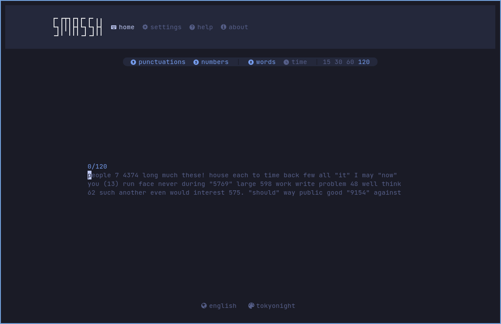

<h1 align="center"> 🖥️ My Awesome TUI Apps </h1>

<div align="center">


*A curated collection of powerful Terminal User Interface (TUI) applications for developers and power users*

[](https://github.com/mmsaeed509/My-Awesome-TUIs)
[](https://github.com/mmsaeed509/My-Awesome-TUIs)
[](https://github.com/mmsaeed509/My-Awesome-TUIs/issues)
[](https://github.com/mmsaeed509/My-Awesome-TUIs/blob/master/LICENSE)

</div>

## 📋 Table of Contents

- [📋 Table of Contents](#-table-of-contents)
- [🎯 About](#-about)
- [📂 Categories](#-categories)
- [🔍 System Monitoring](#-system-monitoring)
  - [Below](#below)
  - [s-TUI](#s-tui)
  - [nvtop](#nvtop)
  - [asitop](#asitop)
  - [WaveMon](#wavemon)
- [🛠️ Development Tools](#️-development-tools)
  - [LazyGit](#lazygit)
  - [JiraTUI](#jiratui)
  - [Neovate Code](#neovate-code)
- [🐳 Container Management](#-container-management)
  - [LazyDocker](#lazydocker)
  - [Oxker](#oxker)
  - [Ctop](#ctop)
- [📁 File Management](#-file-management)
  - [Superfile](#superfile)
- [🌐 Web \& Media](#-web--media)
  - [Browsh](#browsh)
  - [GopherTube](#gophertube)
  - [Posting](#posting)
  - [Feroxbuster](#feroxbuster)
- [☸️ Kubernetes \& DevOps](#️-kubernetes--devops)
  - [K9s](#k9s)
  - [KubeTUI](#kubetui)
  - [Updo](#updo)
- [⚙️ Utilities](#️-utilities)
  - [Smassh](#smassh)
  - [KBT](#kbt)
  - [Mirro-rs](#mirro-rs)
  - [Impala](#impala)
- [🚀 Installation](#-installation)
  - [Using Package Managers](#using-package-managers)
  - [Manual Installation](#manual-installation)
    - [JiraTUI (Python)](#jiratui-python)
    - [KubeTUI (Rust)](#kubetui-rust)
    - [asitop (Python)](#asitop-python)
    - [Neovate Code (Node.js)](#neovate-code-nodejs)
  - [Prerequisites](#prerequisites)
- [🤝 Contributing](#-contributing)
- [📄 License](#-license)

## 🎯 About

This repository showcases a carefully curated collection of Terminal User Interface (TUI) applications that enhance productivity and provide powerful functionality directly in your terminal. These tools are perfect for developers, system administrators, and power users who prefer keyboard-driven interfaces.

> 💡 **Pro Tip**: Check out [**Exodia-TUI-CLI-Apps**](https://github.com/Exodia-OS/Exodia-TUI-CLI-Apps) for an even more comprehensive collection of TUI applications!

## 📂 Categories

The applications are organized into the following categories for easy navigation:

- 🔍 **System Monitoring** - Resource monitoring and system analysis tools
- 🛠️ **Development Tools** - Git management and development utilities
- 🐳 **Container Management** - Docker and container orchestration tools
- 📁 **File Management** - File system navigation and management
- 🌐 **Web & Media** - Web browsing and media consumption
- ☸️ **Kubernetes & DevOps** - Kubernetes management and DevOps tools
- ⚙️ **Utilities** - Various utility applications

---

## 🔍 System Monitoring

### [Below](https://github.com/facebookincubator/below)
A time traveling resource monitor for modern Linux systems with advanced debugging capabilities.


**Features:**
- Real-time system resource monitoring
- Historical data analysis
- Advanced debugging tools
- Modern Linux system support

### [s-TUI](https://github.com/amanusk/s-tui)
Terminal-based CPU stress and monitoring utility with an intuitive interface.


**Features:**
- CPU stress testing
- Real-time temperature monitoring
- System performance metrics
- Interactive terminal interface

### [nvtop](https://github.com/Syllo/nvtop)
GPU & Accelerator process monitoring for AMD, Apple, Huawei, Intel, NVIDIA and Qualcomm.


**Features:**
- Multi-vendor GPU support
- Process monitoring
- Memory usage tracking
- Temperature monitoring
- Power consumption metrics

### [asitop](https://github.com/tlkh/asitop)
Perf monitoring CLI tool for Apple Silicon with detailed performance insights.


**Features:**
- Apple Silicon optimization
- Performance counter monitoring
- CPU and GPU metrics
- Memory bandwidth tracking
- Power efficiency analysis

### [WaveMon](https://github.com/uoaerg/wavemon)
wavemon is an ncurses-based monitoring application for wireless network devices on Linux.


**Features:**
- Wireless network monitoring
- Signal strength tracking
- Network quality analysis
- Real-time statistics
- Linux wireless device support

---

## 🛠️ Development Tools

### [LazyGit](https://github.com/jesseduffield/lazygit)
Simple terminal UI for git commands with an intuitive interface.


**Features:**
- Visual git workflow
- Branch management
- Commit history
- Interactive rebasing

### [JiraTUI](https://github.com/whyisdifficult/jiratui)
A Textual User Interface for interacting with Atlassian Jira from your shell.


**Features:**
- Launch full TUI for Jira issues and workflows
- Search, update, and delete issues
- Manage comments and users
- Config via env, .env or YAML
- Ships CLI with `ui`, `issues`, `comments`, `users`

### [Neovate Code](https://github.com/neovateai/neovate-code)
Neovate Code is a code agent to enhance your development. Use it to generate code, fix bugs, review code, add tests, and more. Supports interactive and headless modes.


**Features:**
- Interactive and headless automation
- Code generation and refactoring
- Bug fixing and code review
- Test generation
- Provider-agnostic with easy model selection

---

## 🐳 Container Management

### [LazyDocker](https://github.com/jesseduffield/lazydocker)
The lazier way to manage everything Docker with a beautiful TUI.


**Features:**
- Container management
- Image management
- Volume management
- Network monitoring

### [Oxker](https://github.com/mrjackwills/oxker)
A simple TUI to view & control Docker containers with ease.


**Features:**
- Container status overview
- Start/stop containers
- Resource usage monitoring
- Log viewing

### [Ctop](https://github.com/bcicen/ctop)
Top-like interface for container metrics with real-time monitoring.


**Features:**
- Real-time container metrics
- Resource usage visualization
- Container management actions
- Multi-container support

---

## 📁 File Management

### [Superfile](https://github.com/yorukot/superfile)
Pretty fancy and modern terminal file manager with advanced features.


**Features:**
- Modern file navigation
- File operations
- Search functionality
- Customizable interface

---

## 🌐 Web & Media

### [Browsh](https://github.com/browsh-org/browsh)
A fully-modern text-based browser, rendering to TTY and browsers.


**Features:**
- Full web browser functionality
- JavaScript support
- Modern web rendering
- Cross-platform compatibility

### [GopherTube](https://github.com/krishnassh/gophertube)
A modern terminal user interface for searching and watching YouTube videos using mpv and chafa.


**Features:**
- YouTube video search
- Video playback with mpv
- Thumbnail previews
- Playlist management

### [Posting](https://github.com/darrenburns/posting)
The modern API client that lives in your terminal.


**Features:**
- REST API testing
- Request/response visualization
- Environment management
- Request history

### [Feroxbuster](https://github.com/epi052/feroxbuster)
A fast, simple, recursive content discovery tool written in Rust.


**Features:**
- Fast recursive content discovery
- Multi-threaded scanning
- Customizable wordlists
- Advanced filtering options
- JSON output support

---

## ☸️ Kubernetes & DevOps

### [K9s](https://github.com/derailed/k9s)
🐶 Kubernetes CLI To Manage Your Clusters In Style!


**Features:**
- Kubernetes cluster management
- Pod monitoring
- Service management
- Resource visualization

### [KubeTUI](https://github.com/sarub0b0/kubetui)
An intuitive Terminal User Interface (TUI) tool for real-time monitoring and exploration of Kubernetes resources.


**Features:**
- Real-time Kubernetes resource monitoring
- Multi-namespace support
- Advanced log filtering and search
- Interactive resource exploration
- YAML viewing and editing
- Context and namespace switching

### [Updo](https://github.com/Owloops/updo)
Uptime monitoring CLI tool with alerting and advanced settings.


**Features:**
- Website uptime monitoring
- Alert notifications
- Custom monitoring intervals
- Status reporting

---

## ⚙️ Utilities

### [Smassh](https://github.com/kraanzu/smassh)
Smassh your Keyboard, TUI Edition - a keyboard testing and training tool.



**Features:**
- Keyboard testing
- Typing speed measurement
- Custom text input
- Performance analytics

### [KBT](https://github.com/bloznelis/kbt)
Keyboard tester in terminal with comprehensive key testing.


**Features:**
- Individual key testing
- Key combination testing
- Keyboard layout verification
- Input validation

### [Mirro-rs](https://github.com/rtkay123/mirro-rs)
An Arch Linux mirrorlist manager with a TUI for optimal package downloads.


**Features:**
- Mirror speed testing
- Automatic mirror selection
- Manual mirror management
- Performance optimization

### [Impala](https://github.com/pythops/impala)
🛜 TUI for managing wifi on Linux with an intuitive interface.


**Features:**
- WiFi network scanning and connection
- Device power management
- Access point creation
- Known networks management
- Custom keybindings support

---

## 🚀 Installation

Most of these applications can be installed using your system's package manager or through their respective installation methods:

### Using Package Managers

```bash
# Arch Linux / Manjaro
yay -S below posting oxker superfile browsh updo k9s ctop lazydocker lazygit impala s-tui nvtop wavemon

# Ubuntu / Debian
sudo apt install ctop s-tui nvtop wavemon

# macOS
brew install k9s ctop lazydocker lazygit s-tui nvtop
```

### Manual Installation

For applications not available in package managers, check their respective GitHub repositories for installation instructions.

#### JiraTUI (Python)

```bash
# Using uv (recommended)
uv add jiratui

# Or using pip
pip install jiratui
```

#### KubeTUI (Rust)

```bash
# Using cargo
cargo install kubetui
```

#### asitop (Python)

```bash
# Using pip
pip install asitop
```

#### Neovate Code (Node.js)

```bash
# Using npm (global)
npm install -g @neovate/code

# Run
neovate
# or
neo
```

### Prerequisites

- Terminal with true color support
- Modern Linux/macOS system
- Git (for cloning repositories)

---

## 🤝 Contributing

Contributions are welcome! Feel free to:

1. Fork this repository
2. Add new TUI applications
3. Improve documentation
4. Fix issues
5. Suggest enhancements

Please ensure that any added applications:
- Have an active GitHub repository
- Include a screenshot or GIF demo
- Are well-maintained and functional
- Provide value to developers or power users

---

## 📄 License

This project is licensed under the `GPL-3.0` License - see the [LICENSE](LICENSE) file for details.

---

<div align="center">

**⭐ Star this repository if you found it helpful!**

Made with ❤️ for the TUI community

</div>